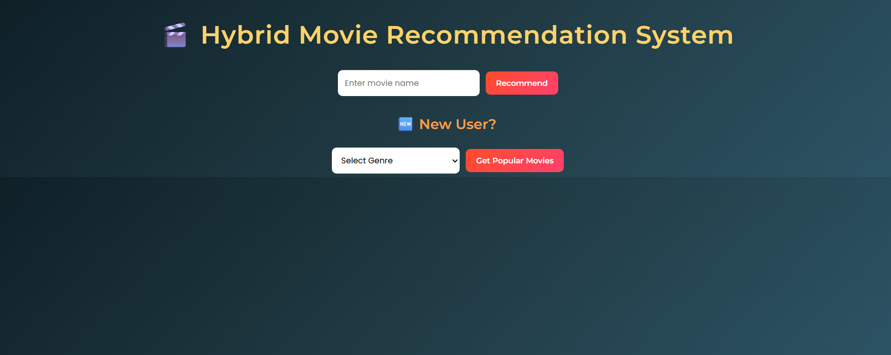
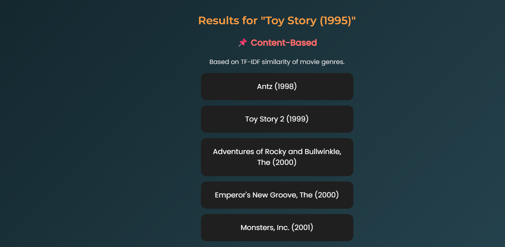
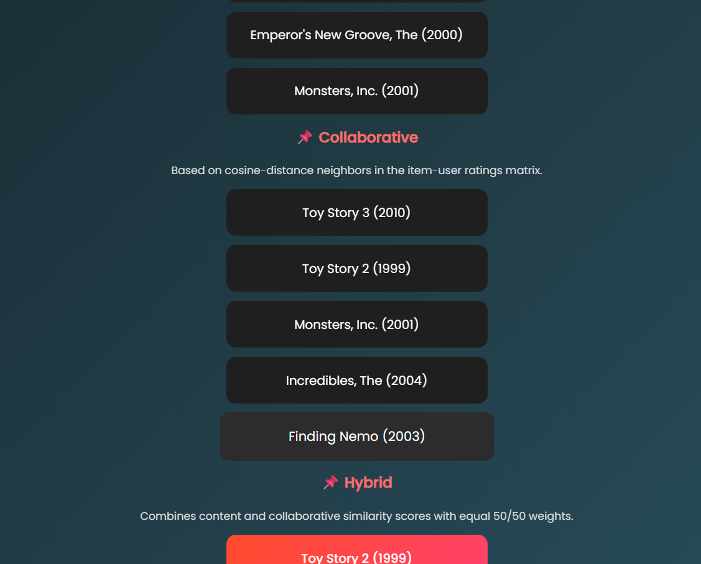
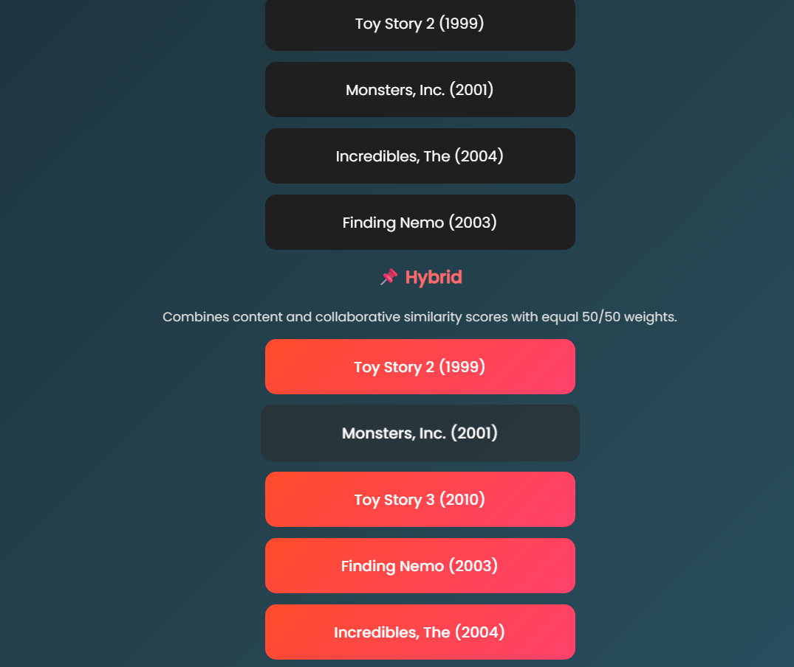
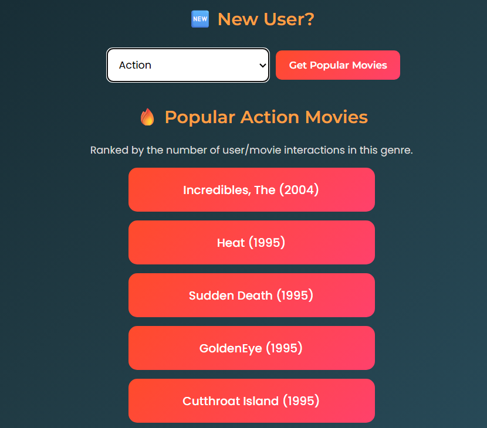
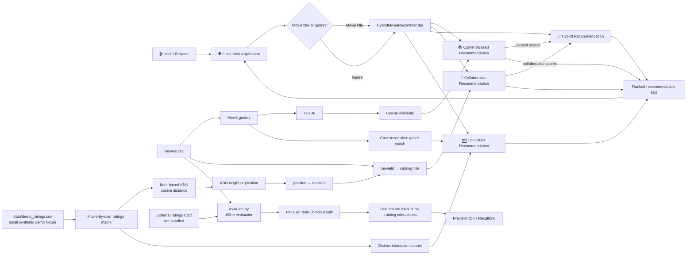

# Hybrid Movie Recommendation System

*A classical machine-learning project combining content-based filtering, item-based collaborative filtering, hybrid ranking, and genre-based cold-start recommendations in a Flask web app.*

## 🚀 Live Demo

https://ml-recommendation-system-chwn.onrender.com

Try **`Toy Story (1995)`**.

## Screenshots

### Landing page



### Toy Story (1995) recommendations







### Genre cold start



## Why I Built This Project

A movie recommender should not rely on only one signal. Content-based recommendations can find titles with similar genres, but they do not use patterns in ratings. Collaborative filtering can capture behavioral similarity between movies, but its results depend on interaction data and can be limited when that data is sparse.

I built this project to understand how recommendation systems move from individual similarity techniques into a complete application. It combines both approaches for title-based recommendations and includes a simple genre-based path for visitors without a movie preference to start from.

## What This Project Does

The Flask interface lets a visitor compare recommendation strategies in one place:

1. Enter a movie title to see content-based recommendations.
2. See item-based collaborative recommendations for the same title.
3. Compare a hybrid list that combines both score types.
4. Select a genre to see popular matching movies in a cold-start-style flow.

For the public demo, a small bundled synthetic ratings fixture keeps the collaborative and hybrid paths usable without requiring MovieLens 25M.

## Feature Overview

| Feature | Implementation |
| --- | --- |
| Content-based filtering | TF-IDF features from catalog genres, ranked by cosine similarity. |
| Collaborative filtering | Item-based nearest neighbors over a movie-by-user ratings matrix, using cosine distance. |
| Hybrid ranking | Equal weighting of content and collaborative similarity scores. |
| Cold-start path | Case-insensitive genre substring matching, ranked by distinct user/movie interactions. |
| Lightweight demo | Tracked `movies.csv` plus bundled `data/demo_ratings.csv`. |
| Offline evaluation | Per-user holdout evaluation on a supplied external ratings dataset. |

## Recommendation Approaches

### Content-Based Filtering

Movie genres are the item features. The model transforms the genre text into TF-IDF vectors and uses cosine similarity to rank other catalog movies against the selected title.

### Collaborative Filtering

The model represents ratings as a movie-by-user interaction matrix and uses item-based K-nearest neighbors with cosine distance. A KNN result is a row position, not a MovieLens ID: the code maps **neighbor position → `movieId` → catalog title** before returning a recommendation.

Cosine distance is converted to a nonnegative similarity score with `max(0, 1 - distance)`. Zero-similarity neighbors remain eligible, preserving the original behavior when KNN returns neighbors with no positive similarity.

### Hybrid Recommendation

The hybrid method combines content and collaborative similarity with equal weights:

```text
Hybrid Score = 0.5 × Content Score + 0.5 × Collaborative Score
```

The seed movie is excluded from the hybrid results.

### Cold-Start Recommendation

The genre option provides a cold-start-style path that does not require a visitor profile or rating history. It matches the selected genre case-insensitively as a substring of the catalog genre text, then ranks matching movies by distinct user/movie interactions in the loaded ratings data. This is a popularity fallback, not personalized ranking.

## Architecture

This diagram follows the two input paths in the Flask route: a movie title produces content, collaborative, and hybrid lists; a genre request uses the cold-start path. Evaluation is a separate offline workflow.



**Interactive Architecture:** [GitDiagram](https://gitdiagram.com/yakshini12/ml-recommendation-system)

## Recommendation Pipeline

1. Flask receives a movie title or genre from the browser.
2. For a title, `HybridMovieRecommender` computes genre-based content scores and item-neighbor collaborative scores, then produces a separate 50/50 hybrid ranking.
3. Collaborative neighbor positions are mapped through the model's movie-ID array and then through the catalog to readable titles.
4. For a genre request, the app skips the title-based lists and returns the cold-start popularity ranking.
5. `evaluate.py` runs separately from the web request path and evaluates recommendations using external ratings data.

## Data

| Data | Purpose | Included in the repository? |
| --- | --- | --- |
| `movies.csv` | Catalog IDs, titles, and genres used by the app. | Yes |
| `data/demo_ratings.csv` | Small, deterministic synthetic ratings for the public demo. | Yes |
| External ratings CSV | Input for a full offline evaluation; use a catalog with matching movie IDs. | No |

The Flask app uses `data/demo_ratings.csv` by default. If `RATINGS_CSV_PATH` points to an existing external CSV, the app can use that file instead. App-side ratings loading is limited to 200,000 rows by default; `RATINGS_MAX_ROWS` accepts a positive row count or `full`. `MOVIES_CSV_PATH` can select a different catalog. Absolute paths and paths relative to the repository root are supported.

The public demo does not load or require MovieLens 25M. The external full ratings dataset is for evaluation and is not committed to this repository.

## Offline Evaluation

`evaluate.py` implements a per-user holdout evaluation. It defaults to loading all rows from the selected ratings CSV; use `--ratings-rows N` to cap rows or `--ratings-rows full` to request the full file explicitly.

For example, with matching MovieLens 25M files stored outside the repository:

```powershell
python evaluate.py --movies "C:\data\ml-25m\movies.csv" --ratings "C:\data\ml-25m\ratings.csv" --ratings-rows full
```

The evaluator averages duplicate user/movie rows before splitting, then creates a seeded per-user holdout while retaining at least one training interaction per user. It fits one recommender—and one shared KNN—on training interactions only. Held-out ratings do not train the model, and training-seen movies are excluded from recommendations.

A held-out movie is relevant when it meets the rating threshold and appears in both the training item set and catalog. Per user, Precision@K is hits divided by K; Recall@K is hits divided by the user's eligible relevant holdout count. The script reports macro averages over users with at least one eligible relevant held-out movie. Defaults are K=10, a 20% per-user holdout, rating threshold 4.0, and random seed 42.

No real-dataset Precision@10 or Recall@10 result is claimed here. The repository's evaluation tests use small fixtures; running MovieLens evaluation requires the external dataset.

## Testing

Run the suite from the repository root:

```powershell
python -m pytest
```

The previously verified suite result was **15 tests passed**. Tests cover the KNN position-to-ID-to-title mapping, zero-similarity neighbors, equal hybrid weights, data-path and row-limit handling, holdout leakage protections, and Flask request flows using demo data.

## Deployment

The live demo is hosted on Render and runs with the bundled lightweight data. The repository includes a Gunicorn `Procfile`; the production start command is:

```sh
gunicorn --bind 0.0.0.0:$PORT app:app
```

The full MovieLens dataset is not needed for the public app. If the service uses Render's Free web-service plan, it spins down after 15 minutes without inbound traffic and may take about a minute to start on the next request; this repository does not specify the service's plan. See [Render's Free service documentation](https://render.com/docs/free).

## Run Locally

Python 3.10 or newer is required. In PowerShell, from the repository directory:

```powershell
python -m venv .venv
.\.venv\Scripts\Activate.ps1
python -m pip install -r requirements.txt
python app.py
```

Open `http://127.0.0.1:5000` and try `Toy Story (1995)`. The local Flask server defaults to host `127.0.0.1` and port `5000`; set `HOST` and `PORT` to override them. Debug mode is disabled. No external ratings file is required for the normal demo.

To point a local app run at an external ratings CSV, configure these variables before starting it:

```powershell
$env:RATINGS_CSV_PATH = "C:\data\ratings.csv"
$env:RATINGS_MAX_ROWS = "200000"
python app.py
```

For full offline evaluation, pass the external ratings and matching catalog paths to `evaluate.py` as shown above. The evaluator's full-data default is separate from the Flask app's 200,000-row default.

## Project Structure

```text
.
├── app.py                    # Flask routes and application startup
├── model.py                  # Data loading and recommendation methods
├── evaluate.py               # Offline per-user holdout evaluation
├── movies.csv                # Tracked movie catalog
├── data/
│   └── demo_ratings.csv      # Small synthetic demo ratings
├── templates/
│   └── index.html            # Movie/genre form and recommendation results
├── static/
│   └── style.css             # Page styling
├── tests/                    # Model, Flask, and evaluation tests
├── requirements.txt          # Python dependencies
└── Procfile                  # Gunicorn start command
```

## Limitations

- Demo ratings are synthetic and small; they make the app paths demonstrable but do not establish real-world recommendation quality.
- Collaborative results depend on overlap in the loaded ratings. The app does not collect visitor ratings or maintain individual profiles.
- Genre cold start is a popularity fallback, not a personalized model.
- Full-data evaluation requires external ratings and a matching catalog. No real MovieLens evaluation metrics are included.
- Render Free services spin down when idle; the plan for this particular demo is not specified.

## Future Improvements

- Run and report a reproducible evaluation with the full external MovieLens dataset.
- Improve input validation and feedback for titles or genres that are not in the catalog.
- Explain which content and collaborative signals contributed to each result.
- Consider a larger maintained dataset and persistence if the project grows beyond the demo.

## Technologies

Python, Flask, Gunicorn, pandas, NumPy, SciPy, scikit-learn, pytest, HTML, and CSS.

## License

No license file is currently included in the repository.
